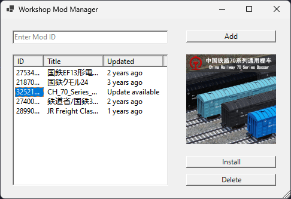

# Steve Workshop Manager

## Motivation

There are many workshop downloader out there, but there is nothing that can manage the downloaded mods. Managing these mods can be cumbersome, especially for users with extensive collections. Manage in the sense of keeping track of the mods, updating them, and installing them. This project aims to develop the Workshop Manager, an application to simplify installing, and updating mods from the Steam Workshop.

## Similar Projects

- [WorkshopDL](https://github.com/imwaitingnow/WorkshopDL)
- [NetherWorkshopDownloader](https://github.com/BerdyAlexei/SCMD-Workshop-Downloader-2)
- [SCMD](https://github.com/BerdyAlexei/SCMD-Workshop-Downloader-2)

Each of these projects has its own strengths and weaknesses, but none of them provide a simple feature to automatically check for updates. This project aims to fill that gap.

## Method

The development of this project will follow the Waterfall model consisting of the following phases:

1. Planning
2. Analysis
3. Design
4. Implementation

## Implementation

### Planning

The project need to be able to download mods, update mods, and install mods from the Workshop packaged in a simple Windows application.

### Analysis

The application will have the following features:

1. Download Mod
   1. User give the ID of the mod to the system.
   2. System fetch the mod data from the Steam Workshop.
   3. System save the mod data to downloaded mods list.
2. Show Downloaded Mods
   1. System reads the downloaded mods list.
   2. System shows the downloaded mods list to the user.
3. Show Downloaded Mod Details
   1. User selects the mod from the downloaded mods list.
   2. System reads the mod details from the downloaded mods list.
   3. System shows the mod details to the user.
4. Delete Downloaded Mod
   1. User selects the mod from the downloaded mods list.
   2. System delete the mod files from the system's mod directory.
   3. System removes the mod from the downloaded mods list.
5. Check for Mod Updates
   1. System reads the downloaded mods list.
   2. System fetch the downloaded mods data from the Steam Workshop.
   3. System updates the downloaded mods in the downloaded mods list.
6. Install Mod
   1. User selects the mod from the downloaded mods list.
   2. System downloads the mod.
   3. System updates the mod data in the downloaded mods list.

The application will use a List like data structure to store the downloaded mods. Each mod will have at least the following attributes:

1. Mod ID, a unique identifier for the mod.
2. Mod Name, the name of the mod.
3. Time Updated, the time the mod was last updated.
4. Time Downloaded, the time the mod was downloaded.

### Design

The technology stack for the project is as follows:

1. PowerShell for scripting
2. Windows Forms for GUI
3. JSON file for data storage

The application will have the following modules:

1. Add Mod
   1. User enters the mod ID from `TextBox`.
   2. User clicks the `Add` button.
   3. System fetches the mod data using Steam Web API.
   4. System inserts the mod data to JSON file.
2. Get Mod List
   1. System reads the JSON file.
   2. System shows the mod data in the `ListView`.
3. Get Mod Details
   1. User selects the mod from the `ListView`.
   2. System reads the mod details from the JSON file.
   3. System shows the mod details beside the `ListView`.
4. Remove Mod
   1. User selects the mod from the `ListView`.
   2. User clicks the `Delete` button.
   3. System deletes the mod files using `Remove-Item`.
   4. System removes the mod data from the JSON file.
5. Check for Mod Updates
   1. System reads the JSON file.
   2. System fetches the downloaded mods data using Steam Web API.
   3. System updates the downloaded mods data in the JSON file.
6. Install Mod
   1. User selects the mod from the `ListView`.
   2. User clicks the `Install` button.
   3. System downloads the mod using SteamCMD.
   4. System updates the mod data in the JSON file.

The GUI will have the following components:

1. `Button` for download, delete, and install.
2. `Details` for mod details.
3. `ListView` for downloaded mods.
4. `TextBox` for mod ID.

The JSON file will follow the structure provided by the Steam Web API:

```json
[
  {
    "id": "123456789",
    "name": "Mod Name",
    "description": "Description...",
    "...": "...",
    "preview_url": "https://...",
    "time_updated": 1605609719,
    "time_downloaded": 1605609819
  }
]
```

### Implementation

The structure of the project is structured as follows:

```plaintext
.
├── bin
├── src
│   ├── Modules
│   │   ├── Add-Mod.ps1
│   │   ├── Get-Mod-Details.ps1
│   │   ├── Get-Mod-List.ps1
│   │   ├── Remove-Mod.ps1
│   │   ├── Update-Mod.ps1
│   ├── Common.ps1
│   ├── Main.ps1
├── Build.ps1
```

The `src` directory contains the source code of the application. The `Main` acts as the entry point of the application. Here every module is imported and the GUI is created. At initialization, the application will download the steamCMD and create a JSON file to store the downloaded mods. Each module from design translates to a script in the `Modules` directory. The scripts contain the logic to perform the actions described in the design.

The application can be run by running:

```powershell
.\src\Main.ps1
```

Distribution of the application is in form of an executable. The executable can be created using `PS2EXE`. For `PS2EXE` to work, the script must be combined into a single file. To combine the script and compile it into an executable, run the following command:

```powershell
.\Build.ps1
```

The executable will be created in the `bin` directory and can be run by double-clicking it.



## Conclusion

The Workshop Manager project aims to fill a gap in existing mod management tools by providing a simple and centralized application for downloading, updating, and managing mods from the Steam Workshop. Through the use of PowerShell scripting and a Windows Forms GUI, the application offers a simple interface and robust functionality, streamlining the mod management process for users. The Waterfall model ensure a structured and systematic approach to building the application.